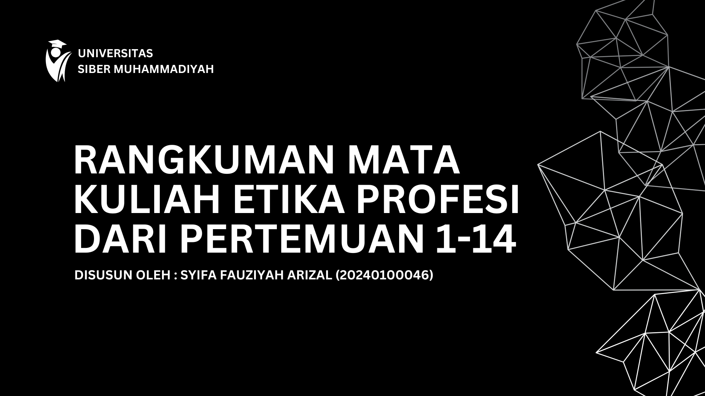

# 🎥 Rangkuman Mata Kuliah Etika Profesi – Video Presentasi

Halo! Saya **Syifa Fauziyah Arizal**, mahasiswa Teknik Informatika di Muhammadiyah Cyber University.  
Proyek ini adalah gabungan antara tanggung jawab akademik dan ekspresi kreatif saya dalam membuat konten edukatif berbasis digital.

## 📚 Tentang Proyek

Video berdurasi ±9 menit ini berisi rangkuman materi dari **14 pertemuan mata kuliah Etika Profesi**.  
Saya mempresentasikan dan menjelaskan materi secara mandiri, sekaligus mendesain presentasi dan mengedit video secara keseluruhan.

🎯 **Tujuan Proyek:**
- Menyampaikan isi materi dengan ringkas, visual, dan mudah dipahami
- Meningkatkan skill public speaking, desain, dan video editing
- Mendokumentasikan pembelajaran sebagai bagian dari portofolio digital

## 🛠️ Tools yang Digunakan
- 🎨 **Desain Slide & Thumbnail:** [Canva](https://www.canva.com/)
- 🎥 **Rekaman Presentasi:** [OBS Studio](https://obsproject.com/)
- ✂️ **Editing Video:** [CapCut Desktop](https://www.capcut.com/)
- 📄 **File Presentasi (PDF):** Tersedia di repo ini

## 🔗 Link Video

👉 [Tonton di YouTube](https://youtu.be/ELhpG7ovqbM?si=7K77URMMiyNoLrSU)

> 📌 *Thumbnail dan slide dibuat secara mandiri dengan Canva*

## 📂 Isi Repo
<pre><code>
| File | Deskripsi |
|------|-----------|
| `thumbnail.jpg` | Gambar cover video |
| `slide-etika-profesi.pdf` | Slide PDF presentasi |
| `README.md` | Dokumentasi proyek |
</code></pre>

## ✨ Kenapa Ini Layak Masuk Portofolio?
- ✅ Menunjukkan kemampuan multi-skill (desain, presentasi, teknikal)
- ✅ Contoh nyata self-driven learning & personal branding akademik
- ✅ Cocok sebagai bahan pertimbangan untuk rekrutmen, magang, atau kolaborasi

---

📩 _Tertarik diskusi atau ingin masukan?_  
Hubungi saya via [LinkedIn](#https://www.linkedin.com/in/syifaarizal/) atau email: **[syifairgi@gmail.com]**